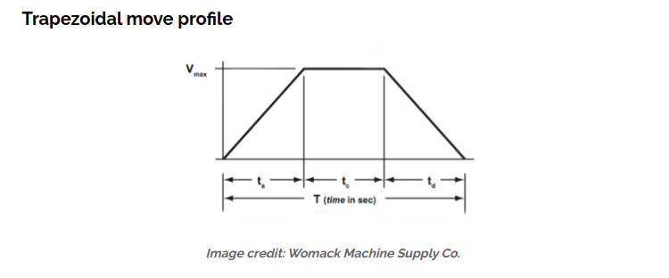

# Whitmore Lake Linear Profile for Robot Motion

Whitmore Lake Linear Profile uses the simple linear motion equations to first plan the robot straight line motion then adjust the motor values to follow that plan while moving.    This module will allow a robot perform a desired motion by specifying the distance, max velocity, and accelleration.   The resulting velocity curve will look like a trapizoid.

image credit https://www.linearmotiontips.com/how-to-calculate-velocity/

First a little bit of theory.   Please, please follow the advice of my 11th grade physics teacher Mr. Camp and always include your units in the math you are doing.    If you do and they line up then you have a high chance of being correct in your math.

## Problem Statement:   

We want to move the robot 72 inches.   It has a desired top speed of 80 inches per second.  The desired top speed MUST be slower than the theroetical top speed which is found by Max Motor RPM, Gearbox ratio and wheel size calculations.    Most WL robots have a theoretical max speed of 14 feet per second or 168 inches per second.   Generally speaking pick the top speed for auton between 45% and 75% of the theoretical maximum speed.

We have 72 inches.  This can be measured on the floor with a tape measure.  This is a value that we have becase we know we want to drive from point A to point B on the field.

We have choosen to move at 80 inches / second.    We want to make this move pretty quickly but we do need a level of accuracy.

The most simple formula that we have is **distance = rate * time  distance** is measured in inches, rate is in inches per second, time in seconds will allow us to predict when the robot has moved far enough.   

Do a little adjustment of the formula and we get **distance / rate = time**.    (72 inches)/(80 inches/second) = seconds or 0.90 seconds.   We could just turn the motors on full speed for 0.90 seconds and then turn them off and we should move 72 inches.     This is the most crude of path planning and is not reliable for consistent Autonumous runs and nowhere close to good enough for vision guided operations.

## Same problem only now allow for some accel and decel time

distance 72 inches
velocity 80 inches / second 
acceleration 192 inches / second / second

*Note:* on this 192 inches / second / second accleration.    This will sound crazy high.  It is not  on carpet with good traction the robots can accellerate to a max speed pretty fast, espcially if the current on the motor controlers are not limited.    Gravity is known to be 32 feet /sec /sec   or about 384 inches / sec / sec so this 192 is a .5g acceleration.  On carpet with unlimited current the robot should easily achieve an accleration between 1g and 2g.

New formula to account for the acceleration... to make things better we know we start our movement from a stop... so we have velocity_start = 0 inches /second.

**velocity_final = velocity_start + (acceleration * time)**

**velocity_final - velocity_start = accleration * time**

**(velocity_final -  velocity_start) / acceleration = time**

**(80 inches / second  - 0 inches / second) / 200 inches/second/second = time)**

**(80 inches / second ) / (192 inches / second / second) = time**

**0.40 seconds = time**

Wait... that is not the same answer what gives... This only acounts for the speed up it does not allow any time for stopping.    We must allow time for the robot to decellerate to a stop.    It is the same answer... It will take 0.40 seconds for the robot to apply the brakes and slow down.   

0.42 + 0.42 still is not the calculated amount of time needed to make the move of 72 inches... and the answer is there is still a part of the calculations that are missing.   That is the cruise time.   There is a small slice of time in the middle where the robot is actually reached a cruise speed of 80 inches / second.    That time is 0.07 seconds.

# How do we apply this to a robot ?

As I hope you know our robots run commands with an init, execute, end phases   

